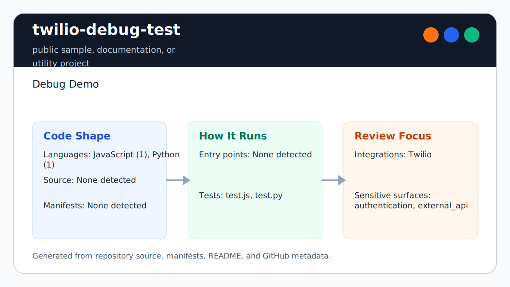

# twilio-debug-test

<!-- README-OVERVIEW-IMAGE -->


## Overview

`garethpaul/twilio-debug-test` is a public sample, documentation, or utility project. Debug Demo

This README is based on the checked-in source, manifests, scripts, and repository metadata on the `main` branch. The project language mix found during review was: JavaScript (1), Python (1).

## Repository Contents

- `README.md` - project overview and local usage notes
- `SECURITY.md` - security reporting and disclosure guidance
- `VISION.md` - project direction and maintenance guardrails

Additional scan context:

- Source directories: no top-level source directories detected
- Dependency and build manifests: none detected
- Entry points or build surfaces: none detected
- Test-looking files: test.js, test.py

## Getting Started

### Prerequisites

- Git

### Setup

```bash
git clone https://github.com/garethpaul/twilio-debug-test.git
cd twilio-debug-test
```

The setup commands above are derived from repository files. Legacy mobile, Python, or JavaScript samples may require older SDKs or package versions than a modern workstation uses by default.

## Running or Using the Project

- Run `make check` to check the Python and Node.js samples.
- Set `TWILIO_TO`, `TWILIO_FROM`, and `TWILIO_BODY` before running either
  sample. Both samples trim required settings, dry-run by default, and only send
  a live SMS when `TWILIO_SEND_LIVE=true` is set with valid Twilio credentials.
- The Python sample reports expected configuration errors as concise stderr
  messages and exits non-zero instead of printing tracebacks.
- The Node.js sample accepts an optional client factory for mocked live-send
  tests without importing the Twilio package.
- Node.js and Python live sends default to `info` logging; set
  `TWILIO_LOG_LEVEL=debug` only when you are ready to redact and review debug
  output before sharing it. The Node.js sample accepts `warning` as an alias
  for Twilio's `warn` log level.

## Testing and Verification

- `make check`
- `python3 -m unittest discover -s tests -p 'test_*.py'`
- `node tests/test_js_contracts.js`
- Node.js and Python tests keep live-send logging at `info` unless
  `TWILIO_LOG_LEVEL` explicitly opts into a supported level.
- Node.js tests cover the live-send payload and log-level assignment with a
  fake Twilio client factory.
- Completed maintenance plans live under `docs/plans` and are checked by
  `make check`.

When the required SDK or runtime is unavailable, use static checks and source review first, then verify on a machine that has the matching platform toolchain.

## Configuration and Secrets

- Detected references to Twilio. Keep API keys, OAuth credentials, tokens, and account-specific values in local configuration only.

## Security and Privacy Notes

- Review changes touching authentication or token handling; examples from the scan include test.js.
- Review changes touching external API calls or credential-adjacent configuration; examples from the scan include test.js, test.py.

## Maintenance Notes

- See `SECURITY.md` for vulnerability reporting and safe research guidance.
- See `VISION.md` for project direction and contribution guardrails.
- See `docs/plans/2026-06-08-python-log-level-opt-in.md` for Python
  live-send log-level opt-in coverage.
- See `docs/plans/2026-06-09-node-warning-log-level.md` for Node.js
  `warning` log-level alias coverage.
- See `docs/plans/2026-06-09-python-cli-errors.md` for Python CLI validation
  error handling coverage.
- See `docs/plans/2026-06-09-node-client-factory.md` for Node.js mocked
  live-send coverage.

## Contributing

Keep changes small and tied to the project that is already present in this repository. For code changes, document the toolchain used, avoid committing generated dependency directories or local configuration, and update this README when setup or verification steps change.
